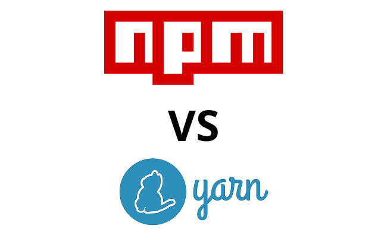

<p align="center">
  
</p>

# npm vs yarn in CI/CD pipeline

A (hopefully) comprehensive speed experiment for npm and yarn install in CI/CD pipeline

Check [HERE](https://medium.com/@jeromewus/how-to-speed-up-node-js-modules-installation-in-ci-cd-pipeline-as-of-2020-4865d77c0eb7) for the result of this experiment!


## Preparation

Before starting the experiment, please run `bootstrap.sh` to:

- Start local registry
- Generate cache in local registry
- Generate node\_modules.tar.gz
- Generate cache.tar.gz

```
$ bash bootstrap.sh
```

After the experiment, don't forget to run followin command to clean up local registry:

```
$ bash stop-local-registry.sh
```

## Execution

You can use `run-test.sh` to run experiments, the syntax are like this:

```
$ bash run-test.sh <Number of iterations> c<Configuration>-<Command>
```

There are 4 commands you can use:

- npm-install
- npm-ci
- yarn-install
- yarn-install-fl

For example, if you want to execute `npm install` in configuration #1 (FFFF) for 3 iterations:

```
$ bash run-test.sh 3 c1-npm-install
```

Sample output:

```
Run c1-npm-install 3 times
[1]: Spend 35.150 Seconds.
Average: 35 Seconds.
[2]: Spend 32.064 Seconds.
Average: 33 Seconds.
[3]: Spend 27.108 Seconds.
Average: 31 Seconds.
```
